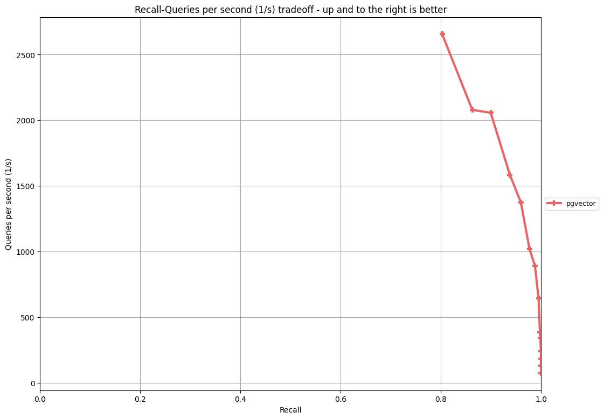

# [AI] ann benchmark 활용한 pgvector 벤치마크

 
## 개요

[Ann benchmark](https://github.com/binidxaba/ann-benchmarks/tree/main) 프로젝트는 다양한 근사 최근접 이웃(approximate nearest neighbor) 검색 솔루션들을 벤치마킹할 수 있는 도구를 제공합니다


미리 생성된 데이터셋(HDF5 형식)과 각 알고리즘을 위한 Docker 컨테이너를 사용하여 성능을 측정하고, 시각화 결과를 제공해 줍니다 

## 테스트 환경

github 에서는 AWS의 r6i.16xlarge 인스턴스에서 `--parallelism 31`  hyperthreading을 제거하고 수행하였습니다 


테스트환경은 github에 명기된 인스턴스 보다, 작은 환경이며 다음과 같습니다 

| VM | 용도 | Shape | Storage | 
| --- | --- | --- | --- | 
| ann-bench | benchmark 서버 | VM 16 CPU, 192GB Mem | 100 GB | 


부트볼륨 IOPS를 최대로 구성했습니다. (github의 AWS인스턴스 IO 최대대역폭은 20Gbps) 


 

## 벤치마크 환경 구성

benchmark가 파이썬 3.10에서 테스트 되었으므로, 간단하게 dnf도구로 파이썬 환경을 3.11 을 구성합니다 

```bash
$ python -V
Python 3.6.8

$ sudo dnf install python311

$ sudo update-alternatives --config python3

There are 2 programs which provide 'python3'.

  Selection    Command
-----------------------------------------------
*+ 1           /usr/bin/python3.6
   2           /usr/bin/python3.11

Enter to keep the current selection[+], or type selection number: 2

$ python -V
Python 3.11.9

$ python -m venv annbench

$ source annbench/bin/activate

```

git을 구성하고 clone합니다 

```bash
$ sudo dnf install git

$ git clone https://github.com/erikbern/ann-benchmarks.git
Cloning into 'ann-benchmarks'...
remote: Enumerating objects: 8199, done.
remote: Total 8199 (delta 0), reused 0 (delta 0), pack-reused 8199 (from 1)
Receiving objects: 100% (8199/8199), 21.88 MiB | 8.34 MiB/s, done.
Resolving deltas: 100% (5207/5207), done.
```

라이브러리를 설치합니다

```bash
$ cd ann-benchmarks/
$ pip install -r requirements.txt 
```

도커를 구성하고, install.py 를 실행합니다 

```bash
$ sudo dnf config-manager --add-repo=https://download.docker.com/linux/centos/docker-ce.repo
$ sudo dnf remove -y runc
$ sudo dnf install -y docker-ce --nobest

$ sudo systemctl enable docker.service
$ sudo systemctl start docker.service

$ sudo /usr/sbin/groupadd -f docker
$ sudo /usr/sbin/usermod -aG docker opc

터미널을 로그아웃 후 다시 로그인해야 docker관련 권한이 반영됩니다
```

install.py 를 실행할때, 파라메터로 도커 빌드를 위한 proc값을 올리거나, 특정 algorithm을 지정할 수 있습니다 

```bash
$ python install.py --help
usage: install.py [-h] [--proc PROC] [--algorithm NAME] [--build-arg BUILD_ARG [BUILD_ARG ...]]

options:
  -h, --help            show this help message and exit
  --proc PROC           the number of process to build docker images (default: 1)
  --algorithm NAME      build only the named algorithm image (default: None)
  --build-arg BUILD_ARG [BUILD_ARG ...]
                        pass given args to all docker builds (default: None)
```

파라메터 없이 기본 커맨드로 수행하면, 약 1시간의 도커 컴파일이 진행되고, 결과를 뿌려 줍니다

모든 도커이미지를 빌드하면 60GB 정도의 로컬 스토리지가 필요합니다

테스트하고자 하는 도커 이미지만 빌드하길 추천 합니다

```bash
$ python install.py

중략..

Install Status:
{'py': 'fail'}
{'annoy': 'success'}
{'balltree': 'success'}
{'base': 'success'}
{'bruteforce': 'success'}
{'ckdtree': 'success'}
{'datasketch': 'success'}
{'descartes': 'success'}
{'diskann': 'fail'}
{'dolphinnpy': 'success'}
{'dummy_algo': 'success'}
{'elasticsearch': 'success'}
{'elastiknn': 'success'}
{'expann': 'success'}
{'faiss': 'success'}
{'faiss_gpu': 'success'}
{'faiss_hnsw': 'success'}
{'flann': 'success'}
{'glass': 'success'}
{'hnswlib': 'success'}
{'kdtree': 'success'}
{'kgn': 'success'}
{'kgraph': 'fail'}
{'luceneknn': 'success'}
{'milvus': 'success'}
{'mrpt': 'success'}
{'n2': 'success'}
{'nearpy': 'fail'}
{'nmslib': 'success'}
{'nndescent': 'success'}
{'onng_ngt': 'success'}
{'opensearchknn': 'success'}
{'panng_ngt': 'success'}
{'parlayann': 'success'}
{'pg_embedding': 'success'}
{'pgvecto_rs': 'success'}
{'pgvector': 'success'}
{'puffinn': 'success'}
{'pynndescent': 'success'}
{'qdrant': 'success'}
{'qg_ngt': 'success'}
{'qsg_ngt': 'success'}
{'redisearch': 'success'}
{'rpforest': 'fail'}
{'scann': 'success'}
{'sptag': 'fail'}
{'subprocess': 'fail'}
{'tinyknn': 'fail'}
{'vald': 'success'}
{'vearch': 'success'}
{'vespa': 'success'}
{'voyager': 'success'}
{'weaviate': 'success'}
{'__pycache__': 'fail'}
```

cpu를 16개를 써서 빌드하면, 수분만에 종료됩니다

```bash
$ python install.py --proc 16
```

개별 알고리즘만 지정하여 빌드할 수도 있습니다

```bash
$ python install.py --proc 16 --algorithm pgvector
$ python install.py --proc 16 --algorithm qdrant
```

# 벤치마크 테스트

run.py 를 실행하여, vector 검색 벤치마크를 테스트합니다

주요 파라메터로, algorithm, dataset, runs, parallelism, count, batch 등을 지정하여 수행할 수 있습니다

- 파라메터
    - algorithm : 테스트할 솔루션. default 는 None
    - dataset : 테스트할 데이터 셋. default 는 glove-100-angular
    - runs : 반복 수행 횟수로 그 중에서 최적의 값을 사용. default 5 회
    - parallelism : 컨테이너 병렬도로 여러 알고리즘을 동시 테스트시에 유용. default 1
    - count : 최근접 이웃 탐색 개수. default 10
    - batch : 알고리즘이 모든 쿼리를 한번에 수행

```bash
$ python run.py --help
usage: run.py [-h] [--dataset NAME] [-k COUNT] [--definitions FOLDER] [--algorithm NAME] [--docker-tag NAME] [--list-algorithms]
              [--force] [--runs COUNT] [--timeout TIMEOUT] [--local] [--batch] [--max-n-algorithms MAX_N_ALGORITHMS]
              [--run-disabled] [--parallelism PARALLELISM]

options:
  -h, --help            show this help message and exit
  --dataset NAME        the dataset to load training points from (default: glove-100-angular)
  -k COUNT, --count COUNT
                        the number of near neighbours to search for (default: 10)
  --definitions FOLDER  base directory of algorithms. Algorithm definitions expected at 'FOLDER/*/config.yml' (default:
                        ann_benchmarks/algorithms)
  --algorithm NAME      run only the named algorithm (default: None)
  --docker-tag NAME     run only algorithms in a particular docker image (default: None)
  --list-algorithms     print the names of all known algorithms and exit (default: False)
  --force               re-run algorithms even if their results already exist (default: False)
  --runs COUNT          run each algorithm instance COUNT times and use only the best result (default: 5)
  --timeout TIMEOUT     Timeout (in seconds) for each individual algorithm run, or -1if no timeout should be set (default: 7200)
  --local               If set, then will run everything locally (inside the same process) rather than using Docker (default:
                        False)
  --batch               If set, algorithms get all queries at once (default: False)
  --max-n-algorithms MAX_N_ALGORITHMS
                        Max number of algorithms to run (just used for testing) (default: -1)
  --run-disabled        run algorithms that are disabled in algos.yml (default: False)
  --parallelism PARALLELISM
                        Number of Docker containers in parallel (default: 1)

```

pgvector에서 glove-25-angular 데이터 셋(121MB) 을 벤치마크합니다 

m 16 기준으로 인덱스 빌드는 15분 이상 소요되고, 쿼리수행도 21분 이상 소요됩니다 (non-batch 모드)

m 24 기준으로는 더 큰 인덱스 사이즈, 더 긴 인덱스 빌드 타임이 필요합니다

디폴트 값으로 수행시 runs가 default 5이기 때문에 쿼리를 5번 수행하여 가장 좋은 값을 결과로 뽑아내고, M 16, 24 두개의 인덱스 옵션 기준으로 테스트를 수행합니다 

HNSW 인덱스에서 m, ef_construction 개념 

- `m` - the max number of connections per layer (16 by default)
- `ef_construction` - the size of the dynamic candidate list for constructing the graph (64 by default)

```bash
$ python run.py --dataset glove-25-angular --algorithm pgvector 
downloading https://ann-benchmarks.com/glove-25-angular.hdf5 -> data/glove-25-angular.hdf5...
2024-09-10 07:52:28,675 - annb - INFO - running only pgvector
2024-09-10 07:52:28,739 - annb - INFO - Order: [Definition(algorithm='pgvector', constructor='PGVector', module='ann_benchmarks.algorithms.pgvector', docker_tag='ann-benchmarks-pgvector', arguments=['angular', {'M': 16, 'efConstruction': 200}], query_argument_groups=[[10], [20], [40], [80], [120], [200], [400], [800]], disabled=False), Definition(algorithm='pgvector', constructor='PGVector', module='ann_benchmarks.algorithms.pgvector', docker_tag='ann-benchmarks-pgvector', arguments=['angular', {'M': 24, 'efConstruction': 200}], query_argument_groups=[[10], [20], [40], [80], [120], [200], [400], [800]], disabled=False)]
2024-09-10 07:52:28,981 - annb.787aedb2db4b - INFO - Created container 787aedb2db4b: CPU limit 1, mem limit 196300294912, timeout 7200, command ['--dataset', 'glove-25-angular', '--algorithm', 'pgvector', '--module', 'ann_benchmarks.algorithms.pgvector', '--constructor', 'PGVector', '--runs', '5', '--count', '10', '["angular", {"M": 16, "efConstruction": 200}]', '[10]', '[20]', '[40]', '[80]', '[120]', '[200]', '[400]', '[800]']
2024-09-10 07:52:29,139 - annb.787aedb2db4b - INFO - ['angular', {'M': 16, 'efConstruction': 200}]
2024-09-10 07:52:29,140 - annb.787aedb2db4b - INFO - Trying to instantiate ann_benchmarks.algorithms.pgvector.PGVector(['angular', {'M': 16, 'efConstruction': 200}])
2024-09-10 07:52:29,240 - annb.787aedb2db4b - INFO - Got a train set of size (1183514 * 25)
2024-09-10 07:52:29,240 - annb.787aedb2db4b - INFO - Got 10000 queries
2024-09-10 07:52:29,317 - annb.787aedb2db4b - INFO -  * Starting PostgreSQL 16 database server
2024-09-10 07:52:33,896 - annb.787aedb2db4b - INFO -    ...done.
2024-09-10 07:52:33,917 - annb.787aedb2db4b - INFO - copying data...
2024-09-10 07:52:36,750 - annb.787aedb2db4b - INFO - creating index...
2024-09-10 08:07:32,854 - annb.787aedb2db4b - INFO - done!
2024-09-10 08:07:32,855 - annb.787aedb2db4b - INFO - Built index in 903.5685021877289
2024-09-10 08:07:32,855 - annb.787aedb2db4b - INFO - Index size:  474632.0
2024-09-10 08:07:32,855 - annb.787aedb2db4b - INFO - Running query argument group 1 of 8...
2024-09-10 08:07:32,855 - annb.787aedb2db4b - INFO - Run 1/5...
2024-09-10 08:07:33,372 - annb.787aedb2db4b - INFO - Processed 1000/10000 queries...
2024-09-10 08:07:33,884 - annb.787aedb2db4b - INFO - Processed 2000/10000 queries...
2024-09-10 08:07:34,392 - annb.787aedb2db4b - INFO - Processed 3000/10000 queries...
2024-09-10 08:07:34,892 - annb.787aedb2db4b - INFO - Processed 4000/10000 queries...
2024-09-10 08:07:35,393 - annb.787aedb2db4b - INFO - Processed 5000/10000 queries...
2024-09-10 08:07:35,896 - annb.787aedb2db4b - INFO - Processed 6000/10000 queries...
2024-09-10 08:07:36,409 - annb.787aedb2db4b - INFO - Processed 7000/10000 queries...
2024-09-10 08:07:36,915 - annb.787aedb2db4b - INFO - Processed 8000/10000 queries...
2024-09-10 08:07:37,421 - annb.787aedb2db4b - INFO - Processed 9000/10000 queries...
2024-09-10 08:07:37,929 - annb.787aedb2db4b - INFO - Processed 10000/10000 queries...
2024-09-10 08:07:37,930 - annb.787aedb2db4b - INFO - Run 2/5...

중략.. 

2024-09-10 08:28:22,102 - annb.787aedb2db4b - INFO - Processed 10000/10000 queries...
2024-09-10 08:28:23,026 - annb.787aedb2db4b - INFO - Child process for container 787aedb2db4b returned exit code 0 with message 
2024-09-10 08:28:23,026 - annb.787aedb2db4b - INFO - Removing container

M 24기준으로 컨테이너를 초기화하고 전체 테스트를 재 수행..

2024-09-10 08:28:23,274 - annb.b145cdc0a4e5 - INFO - Created container b145cdc0a4e5: CPU limit 1, mem limit 196299336448, timeout 7200, command ['--dataset', 'glove-25-angular', '--algorithm', 'pgvector', '--module', 'ann_benchmarks.algorithms.pgvector', '--constructor', 'PGVector', '--runs', '5', '--count', '10', '["angular", {"M": 24, "efConstruction": 200}]', '[10]', '[20]', '[40]', '[80]', '[120]', '[200]', '[400]', '[800]']
2024-09-10 08:28:23,436 - annb.b145cdc0a4e5 - INFO - ['angular', {'M': 24, 'efConstruction': 200}]
2024-09-10 08:28:23,436 - annb.b145cdc0a4e5 - INFO - Trying to instantiate ann_benchmarks.algorithms.pgvector.PGVector(['angular', {'M': 24, 'efConstruction': 200}])
2024-09-10 08:28:23,538 - annb.b145cdc0a4e5 - INFO - Got a train set of size (1183514 * 25)
2024-09-10 08:28:23,539 - annb.b145cdc0a4e5 - INFO - Got 10000 queries
2024-09-10 08:28:23,610 - annb.b145cdc0a4e5 - INFO -  * Starting PostgreSQL 16 database server

```

glove 데이터셋의 구성입니다 


컨테이너의 postgresl에 psql기반으로 쿼리하여, 인덱스 빌드 상태를 볼수 있습니다 

```bash
$ docker ps
CONTAINER ID   IMAGE                     COMMAND                   CREATED         STATUS         PORTS     NAMES
787aedb2db4b   ann-benchmarks-pgvector   "python3 -u run_algo…"   2 minutes ago   Up 2 minutes             elated_ramanujan

$ docker exec -it 787aedb2db4b psql -d ann -U ann -c "SELECT phase, round(100.0 * blocks_done / nullif(blocks_total, 0), 1) FROM pg_stat_progress_create_index;"
             phase              | round 
--------------------------------+-------
 building index: loading tuples |  59.4
(1 row)

$ docker exec -it 75cb425ce34f psql -d ann -U ann -c "SELECT count(*) from items;"
  count  
---------
 1183514
(1 row)

$ docker exec -it 75cb425ce34f psql -d ann -U ann -c "SELECT * from items limit 1;"
 id |                                                                                                    embedding                                                                                                    
----+-----------------------------------------------------------------------------------------------------------------------------------------------------------------------------------------------------------------
  0 | [-0.28572,1.603,-0.23369,0.42476,0.071835,-1.6633,-0.67747,-0.20066,0.72559,-0.7226,0.096683,1.0443,1.1964,-0.27354,1.4416,0.065021,0.93454,-0.40575,0.9227,-0.29601,-0.51803,0.85121,-1.0339,0.050656,0.13964]
(1 row)

$ while true; do docker exec -it 75cb425ce34f psql -d ann -U ann -c "SELECT phase, round(100.0 * blocks_done / nullif(blocks_total, 0), 1) FROM pg_stat_progress_create_index;"; sleep 3; done
             phase              | round 
--------------------------------+-------
 building index: loading tuples |  82.9
(1 row)

             phase              | round 
--------------------------------+-------
 building index: loading tuples |  83.2
(1 row)

             phase              | round 
--------------------------------+-------
 building index: loading tuples |  83.5
(1 row)

중략..
```

인덱스 빌드 성능을 높이기 위한 파라메터 들입니다

더 빠른 빌드를 원한다면 ann-benchmarks/algorithms/pgvector/module.py 파일을 수정하여 성능을 높일 수 있습니다

```bash
SET maintenance_work_mem = '8GB';
SET max_parallel_maintenance_workers = 7;
SET max_parallel_workers =8;
```

runs를 1회만 수행하고, 모든 쿼리를 한번에 수행하는 batch 모드로 벤치를 수행합니다 

1회 수행시 인덱스 빌드는 15분 이상 소요되고, 쿼리수행은 4분 이상 소요됩니다 (batch 모드)

```bash
$ python run.py --dataset glove-25-angular --algorithm pgvector --runs 1 --batch
2024-09-10 08:38:49,765 - annb - INFO - running only pgvector
2024-09-10 08:38:49,828 - annb - INFO - Order: [Definition(algorithm='pgvector', constructor='PGVector', module='ann_benchmarks.algorithms.pgvector', docker_tag='ann-benchmarks-pgvector', arguments=['angular', {'M': 16, 'efConstruction': 200}], query_argument_groups=[[10], [20], [40], [80], [120], [200], [400], [800]], disabled=False), Definition(algorithm='pgvector', constructor='PGVector', module='ann_benchmarks.algorithms.pgvector', docker_tag='ann-benchmarks-pgvector', arguments=['angular', {'M': 24, 'efConstruction': 200}], query_argument_groups=[[10], [20], [40], [80], [120], [200], [400], [800]], disabled=False)]
2024-09-10 08:38:49,930 - annb.75cb425ce34f - INFO - Created container 75cb425ce34f: CPU limit 0-31, mem limit 196307356416, timeout 7200, command ['--dataset', 'glove-25-angular', '--algorithm', 'pgvector', '--module', 'ann_benchmarks.algorithms.pgvector', '--constructor', 'PGVector', '--runs', '1', '--count', '10', '--batch', '["angular", {"M": 16, "efConstruction": 200}]', '[10]', '[20]', '[40]', '[80]', '[120]', '[200]', '[400]', '[800]']
2024-09-10 08:38:50,124 - annb.75cb425ce34f - INFO - ['angular', {'M': 16, 'efConstruction': 200}]
2024-09-10 08:38:50,125 - annb.75cb425ce34f - INFO - Trying to instantiate ann_benchmarks.algorithms.pgvector.PGVector(['angular', {'M': 16, 'efConstruction': 200}])
2024-09-10 08:38:50,229 - annb.75cb425ce34f - INFO - Got a train set of size (1183514 * 25)
2024-09-10 08:38:50,229 - annb.75cb425ce34f - INFO - Got 10000 queries
2024-09-10 08:38:50,303 - annb.75cb425ce34f - INFO -  * Starting PostgreSQL 16 database server
2024-09-10 08:38:54,788 - annb.75cb425ce34f - INFO -    ...done.
2024-09-10 08:38:54,803 - annb.75cb425ce34f - INFO - copying data...
2024-09-10 08:38:57,075 - annb.75cb425ce34f - INFO - creating index...
2024-09-10 08:53:48,934 - annb.75cb425ce34f - INFO - done!
2024-09-10 08:53:48,934 - annb.75cb425ce34f - INFO - Built index in 898.6629023551941
2024-09-10 08:53:48,934 - annb.75cb425ce34f - INFO - Index size:  474672.0
2024-09-10 08:53:48,934 - annb.75cb425ce34f - INFO - Running query argument group 1 of 8...
2024-09-10 08:53:48,934 - annb.75cb425ce34f - INFO - Run 1/1...
2024-09-10 08:53:54,429 - annb.75cb425ce34f - INFO - Running query argument group 2 of 8...
2024-09-10 08:53:54,429 - annb.75cb425ce34f - INFO - Run 1/1...
2024-09-10 08:54:01,131 - annb.75cb425ce34f - INFO - Running query argument group 3 of 8...
2024-09-10 08:54:01,131 - annb.75cb425ce34f - INFO - Run 1/1...
2024-09-10 08:54:10,287 - annb.75cb425ce34f - INFO - Running query argument group 4 of 8...
2024-09-10 08:54:10,287 - annb.75cb425ce34f - INFO - Run 1/1...
2024-09-10 08:54:23,301 - annb.75cb425ce34f - INFO - Running query argument group 5 of 8...
2024-09-10 08:54:23,301 - annb.75cb425ce34f - INFO - Run 1/1...
2024-09-10 08:54:40,691 - annb.75cb425ce34f - INFO - Running query argument group 6 of 8...
2024-09-10 08:54:40,691 - annb.75cb425ce34f - INFO - Run 1/1...
2024-09-10 08:55:11,871 - annb.75cb425ce34f - INFO - Running query argument group 7 of 8...
2024-09-10 08:55:11,872 - annb.75cb425ce34f - INFO - Run 1/1...
2024-09-10 08:56:07,618 - annb.75cb425ce34f - INFO - Running query argument group 8 of 8...
2024-09-10 08:56:07,618 - annb.75cb425ce34f - INFO - Run 1/1...
2024-09-10 08:57:50,528 - annb.75cb425ce34f - INFO - Child process for container 75cb425ce34f returned exit code 0 with message 
2024-09-10 08:57:50,528 - annb.75cb425ce34f - INFO - Removing container
2024-09-10 08:57:50,776 - annb.36f8be90fa03 - INFO - Created container 36f8be90fa03: CPU limit 0-31, mem limit 196277070592, timeout 7200, command ['--dataset', 'glove-25-angular', '--algorithm', 'pgvector', '--module', 'ann_benchmarks.algorithms.pgvector', '--constructor', 'PGVector', '--runs', '1', '--count', '10', '--batch', '["angular", {"M": 24, "efConstruction": 200}]', '[10]', '[20]', '[40]', '[80]', '[120]', '[200]', '[400]', '[800]']
2024-09-10 08:57:50,965 - annb.36f8be90fa03 - INFO - ['angular', {'M': 24, 'efConstruction': 200}]
2024-09-10 08:57:50,965 - annb.36f8be90fa03 - INFO - Trying to instantiate ann_benchmarks.algorithms.pgvector.PGVector(['angular', {'M': 24, 'efConstruction': 200}])
2024-09-10 08:57:51,068 - annb.36f8be90fa03 - INFO - Got a train set of size (1183514 * 25)
2024-09-10 08:57:51,068 - annb.36f8be90fa03 - INFO - Got 10000 queries
2024-09-10 08:57:51,141 - annb.36f8be90fa03 - INFO -  * Starting PostgreSQL 16 database server
2024-09-10 08:57:55,625 - annb.36f8be90fa03 - INFO -    ...done.
2024-09-10 08:57:55,639 - annb.36f8be90fa03 - INFO - copying data...
2024-09-10 08:57:57,851 - annb.36f8be90fa03 - INFO - creating index...
2024-09-10 09:18:21,121 - annb.36f8be90fa03 - INFO - done!
2024-09-10 09:18:21,121 - annb.36f8be90fa03 - INFO - Built index in 1230.0121557712555
2024-09-10 09:18:21,121 - annb.36f8be90fa03 - INFO - Index size:  593176.0
2024-09-10 09:18:21,121 - annb.36f8be90fa03 - INFO - Running query argument group 1 of 8...
2024-09-10 09:18:21,121 - annb.36f8be90fa03 - INFO - Run 1/1...
2024-09-10 09:18:27,728 - annb.36f8be90fa03 - INFO - Running query argument group 2 of 8...
2024-09-10 09:18:27,728 - annb.36f8be90fa03 - INFO - Run 1/1...
2024-09-10 09:18:35,951 - annb.36f8be90fa03 - INFO - Running query argument group 3 of 8...
2024-09-10 09:18:35,952 - annb.36f8be90fa03 - INFO - Run 1/1...
2024-09-10 09:18:47,603 - annb.36f8be90fa03 - INFO - Running query argument group 4 of 8...
2024-09-10 09:18:47,603 - annb.36f8be90fa03 - INFO - Run 1/1...
2024-09-10 09:19:05,463 - annb.36f8be90fa03 - INFO - Running query argument group 5 of 8...
2024-09-10 09:19:05,463 - annb.36f8be90fa03 - INFO - Run 1/1...
2024-09-10 09:19:33,109 - annb.36f8be90fa03 - INFO - Running query argument group 6 of 8...
2024-09-10 09:19:33,109 - annb.36f8be90fa03 - INFO - Run 1/1...
2024-09-10 09:20:16,289 - annb.36f8be90fa03 - INFO - Running query argument group 7 of 8...
2024-09-10 09:20:16,289 - annb.36f8be90fa03 - INFO - Run 1/1...
2024-09-10 09:21:34,686 - annb.36f8be90fa03 - INFO - Running query argument group 8 of 8...
2024-09-10 09:21:34,686 - annb.36f8be90fa03 - INFO - Run 1/1...
2024-09-10 09:23:54,933 - annb.36f8be90fa03 - INFO - Child process for container 36f8be90fa03 returned exit code 0 with message 
2024-09-10 09:23:54,933 - annb.36f8be90fa03 - INFO - Removing container
2024-09-10 09:23:55,104 - annb - INFO - Terminating 1 workers

```

## 벤치마크 결과 정리

plot.py 의 파라메터 입니다. 

```bash
$ python plot.py --help
usage: plot.py [-h] [--dataset DATASET] [--count COUNT] [--definitions FILE] [--limit LIMIT] [-o OUTPUT]
               [-x {k-nn,epsilon,largeepsilon,rel,qps,p50,p95,p99,p999,distcomps,build,candidates,indexsize,queriessize}]
               [-y {k-nn,epsilon,largeepsilon,rel,qps,p50,p95,p99,p999,distcomps,build,candidates,indexsize,queriessize}]
               [-X X_SCALE] [-Y {linear,log,symlog,logit}] [--raw] [--batch] [--recompute]

options:
  -h, --help            show this help message and exit
  --dataset DATASET
  --count COUNT
  --definitions FILE    load algorithm definitions from FILE
  --limit LIMIT
  -o OUTPUT, --output OUTPUT
  -x {k-nn,epsilon,largeepsilon,rel,qps,p50,p95,p99,p999,distcomps,build,candidates,indexsize,queriessize}, --x-axis {k-nn,epsilon,largeepsilon,rel,qps,p50,p95,p99,p999,distcomps,build,candidates,indexsize,queriessize}
                        Which metric to use on the X-axis
  -y {k-nn,epsilon,largeepsilon,rel,qps,p50,p95,p99,p999,distcomps,build,candidates,indexsize,queriessize}, --y-axis {k-nn,epsilon,largeepsilon,rel,qps,p50,p95,p99,p999,distcomps,build,candidates,indexsize,queriessize}
                        Which metric to use on the Y-axis
  -X X_SCALE, --x-scale X_SCALE
                        Scale to use when drawing the X-axis. Typically linear, logit or a2
  -Y {linear,log,symlog,logit}, --y-scale {linear,log,symlog,logit}
                        Scale to use when drawing the Y-axis
  --raw                 Show raw results (not just Pareto frontier) in faded colours
  --batch               Plot runs in batch mode
  --recompute           Clears the cache and recomputes the metrics

```

create_website.py 의 파라메터입니다. 

```bash
$ python create_website.py --help
usage: create_website.py [-h]
                         [--plottype [{recall/time,recall/buildtime,recall/indexsize,recall/distcomps,rel/time,recall/candidates,recall/qpssize,eps/time,largeeps/time,recall/p50,recall/p95,recall/p99,recall/p999} ...]]
                         [--outputdir OUTPUTDIR] [--latex] [--scatter] [--recompute]

options:
  -h, --help            show this help message and exit
  --plottype [{recall/time,recall/buildtime,recall/indexsize,recall/distcomps,rel/time,recall/candidates,recall/qpssize,eps/time,largeeps/time,recall/p50,recall/p95,recall/p99,recall/p999} ...]
                        Generate only the plots specified
  --outputdir OUTPUTDIR
                        Select output directory
  --latex               generates latex code for each plot
  --scatter             create scatterplot for data
  --recompute           Clears the cache and recomputes the metrics

```

plot.py 를 실행시 권한 에러가 날수 있는데, 벤치마크 결과가 저장되는 result 내부 디렉토리들의 권한 문제입니다. 

다음과 같은 권한 에러 메시지가 발생할 수 있습니다. 


권한관련 에러인데, 컨테이너 내부의 프로세스가 결과 파일을 기록하기 때문입니다. 

하위 디렉토리까지 권한을 부여해 주면, plot.py 를 실행 할수 있습니다. 

```bash
$ sudo chmod -R 775 ./results
```

벤치마크의 결과가 다음과 같이 파라메터로 구분되어 디렉토리 구조 하위에 hdf5 파일로 저장됩니다. 

```bash
$ tree
.
|-- fashion-mnist-784-euclidean.png
|-- gist-960-euclidean.png
|-- glove-100-angular
|   `-- 10
|       `-- pgvector
|           |-- angular_M_16_efConstruction_200_10.hdf5
|           |-- angular_M_16_efConstruction_200_120.hdf5
|           |-- angular_M_16_efConstruction_200_20.hdf5
|           |-- angular_M_16_efConstruction_200_200.hdf5
|           |-- angular_M_16_efConstruction_200_40.hdf5
|           `-- angular_M_16_efConstruction_200_80.hdf5
|-- glove-100-angular.png
|-- glove-25-angular
|   `-- 10
|       |-- pgvector
|       |   |-- angular_M_16_efConstruction_200_10.hdf5
|       |   |-- angular_M_16_efConstruction_200_120.hdf5
|       |   |-- angular_M_16_efConstruction_200_20.hdf5
|       |   |-- angular_M_16_efConstruction_200_200.hdf5
|       |   |-- angular_M_16_efConstruction_200_40.hdf5
|       |   |-- angular_M_16_efConstruction_200_400.hdf5
|       |   |-- angular_M_16_efConstruction_200_80.hdf5
|       |   `-- angular_M_16_efConstruction_200_800.hdf5
|       `-- pgvector-batch
|           |-- angular_M_16_efConstruction_200_10.hdf5
|           |-- angular_M_16_efConstruction_200_120.hdf5
|           |-- angular_M_16_efConstruction_200_20.hdf5
|           |-- angular_M_16_efConstruction_200_200.hdf5
|           |-- angular_M_16_efConstruction_200_40.hdf5
|           |-- angular_M_16_efConstruction_200_400.hdf5
|           |-- angular_M_16_efConstruction_200_80.hdf5
|           |-- angular_M_16_efConstruction_200_800.hdf5
|           |-- angular_M_24_efConstruction_200_10.hdf5
|           |-- angular_M_24_efConstruction_200_120.hdf5
|           |-- angular_M_24_efConstruction_200_20.hdf5
|           |-- angular_M_24_efConstruction_200_200.hdf5
|           |-- angular_M_24_efConstruction_200_40.hdf5
|           |-- angular_M_24_efConstruction_200_400.hdf5
|           |-- angular_M_24_efConstruction_200_80.hdf5
|           `-- angular_M_24_efConstruction_200_800.hdf5
|-- glove-25-angular-batch.png
|-- glove-25-angular.png
|-- mnist-784-euclidean.png
|-- nytimes-256-angular.png
`-- sift-128-euclidean.png

```

결과를 시각화하기 위해 벤치마크 테스트한 파라메터를 지정해 주면 됩니다. 

- 파라메터 지정
    - dataset : 벤치마크한 테스트 셋을 지정
    - count : ann 검색한 변수를 지정
    - batch : batch 모드로 수행했다면 지정

```bash

$ python plot.py --dataset glove-25-angular --count 10 --batch
writing output to results/glove-25-angular-batch.png
Computing knn metrics
  0:                                PGVector(m=16, ef_construction=200, ef_search=10)        0.802     2656.998
Computing knn metrics
  1:                                PGVector(m=16, ef_construction=200, ef_search=20)        0.899     2057.470
Computing knn metrics
  2:                                PGVector(m=16, ef_construction=200, ef_search=40)        0.960     1374.746
Computing knn metrics
  3:                                PGVector(m=16, ef_construction=200, ef_search=80)        0.988      890.986
Computing knn metrics
  4:                               PGVector(m=16, ef_construction=200, ef_search=120)        0.995      642.725
Computing knn metrics
  5:                               PGVector(m=16, ef_construction=200, ef_search=200)        0.998      340.074
Computing knn metrics
  6:                               PGVector(m=16, ef_construction=200, ef_search=400)        1.000      185.139
Computing knn metrics
  7:                               PGVector(m=16, ef_construction=200, ef_search=800)        1.000       99.028
Computing knn metrics
  8:                                PGVector(m=24, ef_construction=200, ef_search=10)        0.863     2079.398
Computing knn metrics
  9:                                PGVector(m=24, ef_construction=200, ef_search=20)        0.938     1584.037
Computing knn metrics
 10:                                PGVector(m=24, ef_construction=200, ef_search=40)        0.977     1019.764
Computing knn metrics
 11:                                PGVector(m=24, ef_construction=200, ef_search=80)        0.994      618.337
Computing knn metrics
 12:                               PGVector(m=24, ef_construction=200, ef_search=120)        0.997      386.266
Computing knn metrics
 13:                               PGVector(m=24, ef_construction=200, ef_search=200)        0.999      241.154
Computing knn metrics
 14:                               PGVector(m=24, ef_construction=200, ef_search=400)        1.000      130.387
Computing knn metrics
 15:                               PGVector(m=24, ef_construction=200, ef_search=800)        1.000       72.266
```

테스트한 결과물 입니다. 



벤치마크 결과를 웹사이트로 만들도록 create_website.py 를 실행합니다. 

```bash
$ python create_website.py --outputdir website
--
PGVector(m=16, ef_construction=200, ef_search=10)
Found cached result
k-nn: 0.52959
Found cached result
epsilon: 0.56547
Found cached result
largeepsilon: 0.84392
Found cached result
rel: 0.0925172
qps: 1817.51
p50: 0.525355
p95: 0.795841
p99: 0.945807
p999: 1.14894
build: 1358.72
candidates: 10
indexsize: 860752
queriessize: 473.588
--
PGVector(m=16, ef_construction=200, ef_search=20)
Found cached result
k-nn: 0.65016
Found cached result
epsilon: 0.69142
Found cached result
largeepsilon: 0.93736
Found cached result
rel: 0.089695
qps: 1275.22
p50: 0.756502
p95: 1.1685
p99: 1.38498
p999: 1.59837
build: 1358.72
candidates: 10
indexsize: 860752
queriessize: 674.983
--
PGVector(m=16, ef_construction=200, ef_search=40)
Found cached result
k-nn: 0.74941
Found cached result
epsilon: 0.79178
Found cached result
largeepsilon: 0.98293
Found cached result
rel: 0.0879879
qps: 848.895
p50: 1.13571
p95: 1.70398
p99: 1.99321
p999: 2.35106
build: 1358.72
candidates: 10
indexsize: 860752
queriessize: 1013.97
--
PGVector(m=16, ef_construction=200, ef_search=80)
Found cached result
k-nn: 0.82481
Found cached result
epsilon: 0.86461
Found cached result
largeepsilon: 0.99636
Found cached result
rel: 0.087077
qps: 529.313
p50: 1.8754
p95: 2.58185
p99: 3.08591
p999: 3.7365
build: 1358.72
candidates: 10
indexsize: 860752
queriessize: 1626.17
--
PGVector(m=16, ef_construction=200, ef_search=120)
Found cached result
k-nn: 0.86039
Found cached result
epsilon: 0.89898
Found cached result
largeepsilon: 0.99863
Found cached result
rel: 0.086705
qps: 386.754
p50: 2.65574
p95: 3.53959
p99: 4.20581
p999: 5.09071
build: 1358.72
candidates: 10
indexsize: 860752
queriessize: 2225.58
--
PGVector(m=16, ef_construction=200, ef_search=200)
Found cached result
k-nn: 0.89727
Found cached result
epsilon: 0.93275
Found cached result
largeepsilon: 0.99979
Found cached result
rel: 0.0863898
qps: 259.287
p50: 3.92151
p95: 5.02758
p99: 5.63956
p999: 6.64196
build: 1358.72
candidates: 10
indexsize: 860752
queriessize: 3319.69
--
PGVector(m=16, ef_construction=200, ef_search=10)
Found cached result
k-nn: 0.80484
Found cached result
epsilon: 0.81601
Found cached result
largeepsilon: 0.97601
Found cached result
rel: 0.0776914
qps: 2567.02
p50: 0.381231
p95: 0.513804
p99: 0.579128
p999: 0.688329
build: 903.569
candidates: 10
indexsize: 474632
queriessize: 184.896
--
PGVector(m=16, ef_construction=200, ef_search=20)
Found cached result
k-nn: 0.90064
Found cached result
epsilon: 0.91188
Found cached result
largeepsilon: 0.99733
Found cached result
rel: 0.0762668
qps: 1922.7
p50: 0.523567
p95: 0.67544
p99: 0.804431
p999: 0.966794
build: 903.569
candidates: 10
indexsize: 474632
queriessize: 246.857
--
PGVector(m=16, ef_construction=200, ef_search=40)
Found cached result
k-nn: 0.95906
Found cached result
epsilon: 0.96726
Found cached result
largeepsilon: 0.99985
Found cached result
rel: 0.0755613
qps: 1306.51
p50: 0.796556
p95: 1.02448
p99: 1.16039
p999: 1.31751
build: 903.569
candidates: 10
indexsize: 474632
queriessize: 363.283
--
PGVector(m=16, ef_construction=200, ef_search=80)
Found cached result
k-nn: 0.98764
Found cached result
epsilon: 0.99174
Found cached result
largeepsilon: 0.99999
Found cached result
rel: 0.0752634
qps: 819.96
p50: 1.25849
p95: 1.55617
p99: 1.66655
p999: 1.90855
build: 903.569
candidates: 10
indexsize: 474632
queriessize: 578.848
--
PGVector(m=16, ef_construction=200, ef_search=120)
Found cached result
k-nn: 0.99498
Found cached result
epsilon: 0.99696
Found cached result
largeepsilon: 1
Found cached result
rel: 0.0751887
qps: 609.189
p50: 1.69706
p95: 2.12097
p99: 2.24282
p999: 2.46312
build: 903.569
candidates: 10
indexsize: 474632
queriessize: 779.121
--
PGVector(m=16, ef_construction=200, ef_search=200)
Found cached result
k-nn: 0.99853
Found cached result
epsilon: 0.99906
Found cached result
largeepsilon: 1
Found cached result
rel: 0.0751533
qps: 328.32
p50: 3.11613
p95: 3.88913
p99: 4.11058
p999: 4.44102
build: 903.569
candidates: 10
indexsize: 474632
queriessize: 1445.64
--
PGVector(m=16, ef_construction=200, ef_search=400)
Found cached result
k-nn: 0.99984
Found cached result
epsilon: 0.9999
Found cached result
largeepsilon: 1
Found cached result
rel: 0.0751415
qps: 178.944
p50: 5.71048
p95: 7.26962
p99: 7.73862
p999: 8.83988
build: 903.569
candidates: 10
indexsize: 474632
queriessize: 2652.41
--
PGVector(m=16, ef_construction=200, ef_search=800)
Found cached result
k-nn: 0.99997
Found cached result
epsilon: 0.99997
Found cached result
largeepsilon: 1
Found cached result
rel: 0.07514
qps: 95.0772
p50: 10.568
p95: 13.6219
p99: 14.365
p999: 15.1699
build: 903.569
candidates: 10
indexsize: 474632
queriessize: 4992.07
--
PGVector(m=16, ef_construction=200, ef_search=10)
Found cached result
k-nn: 0.80238
Found cached result
epsilon: 0.81355
Found cached result
largeepsilon: 0.97391
Found cached result
rel: 0.0777956
qps: 2657
p50: 0.376365
p95: 0.376365
p99: 0.376365
p999: 0.376365
build: 898.663
candidates: 10
indexsize: 474672
queriessize: 178.65
--
PGVector(m=16, ef_construction=200, ef_search=20)
Found cached result
k-nn: 0.89928
Found cached result
epsilon: 0.9105
Found cached result
largeepsilon: 0.99675
Found cached result
rel: 0.0762945
qps: 2057.47
p50: 0.486034
p95: 0.486034
p99: 0.486034
p999: 0.486034
build: 898.663
candidates: 10
indexsize: 474672
queriessize: 230.707
--
PGVector(m=16, ef_construction=200, ef_search=40)
Found cached result
k-nn: 0.9595
Found cached result
epsilon: 0.96774
Found cached result
largeepsilon: 0.99982
Found cached result
rel: 0.0755549
qps: 1374.75
p50: 0.727407
p95: 0.727407
p99: 0.727407
p999: 0.727407
build: 898.663
candidates: 10
indexsize: 474672
queriessize: 345.28
--
PGVector(m=16, ef_construction=200, ef_search=80)
Found cached result
k-nn: 0.9876
Found cached result
epsilon: 0.99165
Found cached result
largeepsilon: 1
Found cached result
rel: 0.0752626
qps: 890.986
p50: 1.12235
p95: 1.12235
p99: 1.12235
p999: 1.12235
build: 898.663
candidates: 10
indexsize: 474672
queriessize: 532.749
--
PGVector(m=16, ef_construction=200, ef_search=120)
Found cached result
k-nn: 0.99482
Found cached result
epsilon: 0.99684
Found cached result
largeepsilon: 1
Found cached result
rel: 0.0751902
qps: 642.725
p50: 1.55588
p95: 1.55588
p99: 1.55588
p999: 1.55588
build: 898.663
candidates: 10
indexsize: 474672
queriessize: 738.531
--
PGVector(m=16, ef_construction=200, ef_search=200)
Found cached result
k-nn: 0.99846
Found cached result
epsilon: 0.99901
Found cached result
largeepsilon: 1
Found cached result
rel: 0.0751534
qps: 340.074
p50: 2.94053
p95: 2.94053
p99: 2.94053
p999: 2.94053
build: 898.663
candidates: 10
indexsize: 474672
queriessize: 1395.79
--
PGVector(m=16, ef_construction=200, ef_search=400)
Found cached result
k-nn: 0.99983
Found cached result
epsilon: 0.9999
Found cached result
largeepsilon: 1
Found cached result
rel: 0.0751415
qps: 185.139
p50: 5.40136
p95: 5.40136
p99: 5.40136
p999: 5.40136
build: 898.663
candidates: 10
indexsize: 474672
queriessize: 2563.87
--
PGVector(m=16, ef_construction=200, ef_search=800)
Found cached result
k-nn: 0.99997
Found cached result
epsilon: 0.99997
Found cached result
largeepsilon: 1
Found cached result
rel: 0.07514
qps: 99.0285
p50: 10.0981
p95: 10.0981
p99: 10.0981
p999: 10.0981
build: 898.663
candidates: 10
indexsize: 474672
queriessize: 4793.29
--
PGVector(m=24, ef_construction=200, ef_search=10)
Found cached result
k-nn: 0.86253
Found cached result
epsilon: 0.87414
Found cached result
largeepsilon: 0.99001
Found cached result
rel: 0.0768577
qps: 2079.4
p50: 0.480908
p95: 0.480908
p99: 0.480908
p999: 0.480908
build: 1230.01
candidates: 10
indexsize: 593176
queriessize: 285.263
--
PGVector(m=24, ef_construction=200, ef_search=20)
Found cached result
k-nn: 0.93758
Found cached result
epsilon: 0.94722
Found cached result
largeepsilon: 0.99918
Found cached result
rel: 0.075822
qps: 1584.04
p50: 0.631299
p95: 0.631299
p99: 0.631299
p999: 0.631299
build: 1230.01
candidates: 10
indexsize: 593176
queriessize: 374.471
--
PGVector(m=24, ef_construction=200, ef_search=40)
Found cached result
k-nn: 0.97673
Found cached result
epsilon: 0.98247
Found cached result
largeepsilon: 0.99992
Found cached result
rel: 0.0753788
qps: 1019.76
p50: 0.980619
p95: 0.980619
p99: 0.980619
p999: 0.980619
build: 1230.01
candidates: 10
indexsize: 593176
queriessize: 581.68
--
PGVector(m=24, ef_construction=200, ef_search=80)
Found cached result
k-nn: 0.99385
Found cached result
epsilon: 0.99619
Found cached result
largeepsilon: 1
Found cached result
rel: 0.0752005
qps: 618.337
p50: 1.61724
p95: 1.61724
p99: 1.61724
p999: 1.61724
build: 1230.01
candidates: 10
indexsize: 593176
queriessize: 959.309
--
PGVector(m=24, ef_construction=200, ef_search=120)
Found cached result
k-nn: 0.99748
Found cached result
epsilon: 0.99851
Found cached result
largeepsilon: 1
Found cached result
rel: 0.0751627
qps: 386.266
p50: 2.58889
p95: 2.58889
p99: 2.58889
p999: 2.58889
build: 1230.01
candidates: 10
indexsize: 593176
queriessize: 1535.67
--
PGVector(m=24, ef_construction=200, ef_search=200)
Found cached result
k-nn: 0.99948
Found cached result
epsilon: 0.99972
Found cached result
largeepsilon: 1
Found cached result
rel: 0.075145
qps: 241.154
p50: 4.14673
p95: 4.14673
p99: 4.14673
p999: 4.14673
build: 1230.01
candidates: 10
indexsize: 593176
queriessize: 2459.74
--
PGVector(m=24, ef_construction=200, ef_search=400)
Found cached result
k-nn: 0.99998
Found cached result
epsilon: 1
Found cached result
largeepsilon: 1
Found cached result
rel: 0.0751402
qps: 130.387
p50: 7.66946
p95: 7.66946
p99: 7.66946
p999: 7.66946
build: 1230.01
candidates: 10
indexsize: 593176
queriessize: 4549.34
--
PGVector(m=24, ef_construction=200, ef_search=800)
Found cached result
k-nn: 1
Found cached result
epsilon: 1
Found cached result
largeepsilon: 1
Found cached result
rel: 0.0751397
qps: 72.2659
p50: 13.8378
p95: 13.8378
p99: 13.8378
p999: 13.8378
build: 1230.01
candidates: 10
indexsize: 593176
queriessize: 8208.24
Building 'glove-100-angular_10_angular'
Building 'glove-25-angular_10_angular'
Building 'glove-25-angular_10_angular-batch'
Building 'pgvector'
Building 'pgvector-batch'
```

빌드한 html을 통해 더 디테일하고 인터랙티브한 결과 분석이 가능합니다. 


